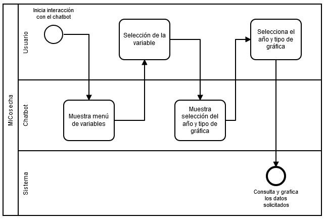
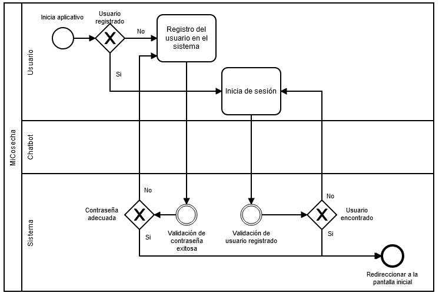

# MiCosecha_Design

## Autor

    Juan Sebastián Sánchez Mancilla

## Contenido

- [MiCosecha_Design](#micosecha-design)
    * [Contenido](#contenido)
    * [Análisis de requerimientos](#an-lisis-de-requerimientos)
    * [Diagramas de casos de uso](#diagramas-de-casos-de-uso)
        + [System](#system)
        + [Login](#login)
        + [Chatbot](#chatbot)
    * [Diagrama de contexto](#diagrama-de-contexto)
    * [Diagrama de despliegue](#diagrama-de-despliegue)
    * [Diagrama de componentes](#diagrama-de-componentes)
    * [Diagramas BPMN](#diagramas-bpmn)
        + [Graph](#graph)
        + [Login](#login-1)
    * [Diagramas de clases](#diagramas-de-clases)
        + [Authorization service](#authorization-service)
        + [Chatbot service](#chatbot-service)
        + [Graph service](#graph-service)
        
## Análisis de requerimientos

[Análisis de requerimientos del sistema](https://github.com/Ataches/MiCosecha_Design/blob/main/Requeriments/Requerimientos.md)

## Diagramas de casos de uso

### System

### Login

### Chatbot

## Diagrama de contexto

## Diagrama de despliegue

## Diagrama de componentes

## Diagramas BPMN

### Graph

### Login

## Diagramas de clases

### Authorization_service

### Chatbot_service

### Graph_service

